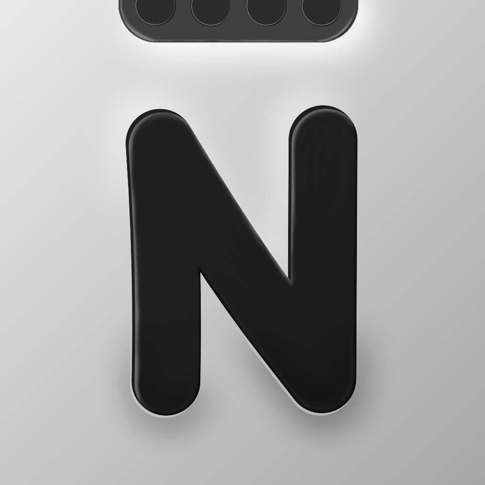
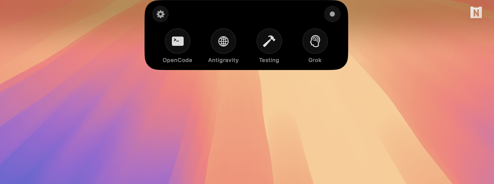

<div align="center">
  

  <h1>NotchSwitch</h1>
  <p><strong>Dynamic Island-style app switcher for MacBook Pro</strong></p>

  <p>
    
    
    
    
  </p>

  <p>
    <a href="https://github.com/Andortk/NotchSwitch/stargazers">
      
    </a>
    <a href="https://github.com/Andortk/NotchSwitch/releases/latest">
      
    </a>
  </p>
</div>

<br>

<p align="center">
  Transform your MacBook Pro's notch from dead space into a <b>powerful productivity hub</b>. NotchSwitch brings iOS-inspired Dynamic Island functionality to macOS — hover over the notch to instantly access your most important apps, browser tabs, and terminal sessions.
</p>

<br>

<div align="center">
  
</div>

<br>

<div align="center">
  
</div>

<br>

---

## ⚡️ Download

<a href="https://github.com/Andortk/NotchSwitch/releases/latest">
  
</a>

> Download the latest `.dmg` from the [Releases](https://github.com/Andortk/NotchSwitch/releases) page.

---

## 💡 Why NotchSwitch?

The MacBook Pro notch takes up valuable screen real estate — why not make it useful?

| Without NotchSwitch | With NotchSwitch |
|:---:|:---:|
| ❌ Dead space on your screen | ✅ Instant access to 4 quick actions |
| ❌ CMD+Tab through dozens of apps | ✅ One hover to your key workflows |
| ❌ Searching for browser tabs | ✅ Jump to specific tabs by URL |
| ❌ Context switching friction | ✅ Seamless workflow transitions |

**Perfect for:**
- 👨‍💻 **Developers** — Quick access to terminal, localhost, and AI assistants
- 🎨 **Designers** — Switch between design tools and inspiration boards
- 🔬 **Researchers** — Jump between papers, references, and notes
- 🎓 **Students** — Balance learning materials and study resources

---

## ✨ Features

### 🏝️ Dynamic Island Experience
Hover over your MacBook's notch to reveal a sleek, iOS-inspired panel with your personalized shortcuts.

### 👤 Work Profiles
Pre-configured profiles tailored to different workflows:
- **Coder / Programming** — Terminal, IDE, testing, AI tools
- **Vibe Coding** — Relaxed coding setup with music and social
- **Student / Teacher / Learning** — Educational resources and AI assistance
- **Researcher** — PDF reader, reference manager, academic search
- **Designer** — Design tools, assets, and prototyping
- **Artist** — Canvas, gallery, and creative inspiration

### 🎯 4 Customizable Quick Actions
Each profile comes with 4 action buttons that can:
- 🚀 **Launch Apps** — Open any application instantly
- 🌐 **Switch Browser Tabs** — Jump to specific tabs by URL pattern
- 💻 **Open Terminal** — Launch your terminal with OpenCode ready

### 🖥️ Terminal Support
Works with all major terminal emulators:
- Alacritty
- Kitty
- Ghostty
- iTerm2
- Terminal.app
- Warp

### 🌍 Browser Support
Seamlessly switch tabs across browsers:
- Google Chrome
- Safari
- Arc
- Brave
- Firefox
- Vivaldi
- Microsoft Edge
- Opera

### 🎵 Media Controls
Quick access to playback controls:
- Play/Pause toggle
- Next/Previous track
- Mission Control shortcut

### 🎨 Customizable Icons
Choose from hundreds of SF Symbols to personalize each button's appearance.

---

## 📋 Requirements

| Requirement | Details |
|-------------|---------|
| **macOS** | 13.0 (Ventura) or later |
| **Hardware** | MacBook Pro with notch (2021 or later) |
| **Permissions** | Accessibility access required |

---

## 📥 Installation

### Option 1: Download DMG (Recommended)

1. Download the latest `.dmg` from [Releases](https://github.com/Andortk/NotchSwitch/releases)
2. Open the DMG and drag NotchSwitch to Applications
3. Launch NotchSwitch from Applications
4. Grant Accessibility permissions when prompted

### Option 2: Homebrew (Coming Soon)

```bash
# Coming soon!
brew install --cask notchswitch
```

---

## 🔐 Permissions

NotchSwitch requires certain permissions to function properly:

### Accessibility Access (Required)
Needed to detect mouse position and control other applications.

**To enable:**
1. Open **System Settings** → **Privacy & Security** → **Accessibility**
2. Click the **+** button and add NotchSwitch
3. Enable the toggle next to NotchSwitch

### Automation (For Browser Tab Switching)
Required to switch tabs in your browser.

**To enable:**
1. Open **System Settings** → **Privacy & Security** → **Automation**
2. Find NotchSwitch and enable permissions for your browser(s)

> **Note:** NotchSwitch runs without the sandbox to enable cross-app control functionality. This is necessary for the app to interact with other applications on your system.

---

## 🛠️ Building from Source

### Prerequisites
- Xcode 15.0 or later
- macOS 13.0 or later

### Build Steps

```bash
# Clone the repository
git clone https://github.com/Andortk/NotchSwitch.git
cd NotchSwitch

# Open in Xcode
open NotchSwitch.xcodeproj

# Build and run (⌘R) or archive for distribution (⌘⇧⌥B)
```

### Project Structure

```
NotchSwitch/
├── NotchSwitch/
│   ├── NotchSwitchApp.swift      # App entry point
│   ├── NotchPanelController.swift # Panel window management
│   ├── NotchContentView.swift     # Main UI view
│   ├── NotchButton.swift          # Action button component
│   ├── SettingsView.swift         # Settings interface
│   ├── AppConfiguration.swift     # User preferences
│   ├── MouseTracker.swift         # Notch hover detection
│   ├── BrowserTabSwitcher.swift   # Browser tab control
│   ├── MediaController.swift      # Media playback control
│   ├── AppSwitcher.swift          # App launching
│   └── PermissionChecker.swift    # Permission management
├── assets/                         # Logo and images
└── NotchSwitch.xcodeproj
```

---

## 🤝 Contributing

Contributions are welcome! Here's how you can help:

1. **Fork** the repository
2. **Create** a feature branch (`git checkout -b feature/amazing-feature`)
3. **Commit** your changes (`git commit -m 'Add amazing feature'`)
4. **Push** to the branch (`git push origin feature/amazing-feature`)
5. **Open** a Pull Request

### Ideas for Contributions
- [ ] Additional work profiles
- [ ] Keyboard shortcuts support
- [ ] Custom themes and colors
- [ ] Widget-style information display
- [ ] Spotlight-like quick search
- [ ] Calendar/reminder integration

---

## 📄 License

This project is licensed under the **MIT License** — see the [LICENSE](LICENSE) file for details.

```
MIT License

Copyright (c) 2024 NotchSwitch

Permission is hereby granted, free of charge, to any person obtaining a copy
of this software and associated documentation files (the "Software"), to deal
in the Software without restriction, including without limitation the rights
to use, copy, modify, merge, publish, distribute, sublicense, and/or sell
copies of the Software, and to permit persons to whom the Software is
furnished to do so, subject to the following conditions:

The above copyright notice and this permission notice shall be included in all
copies or substantial portions of the Software.
```

---

## 🙏 Acknowledgments

- Inspired by Apple's Dynamic Island on iPhone
- Built with SwiftUI and ❤️
- Icons provided by [SF Symbols](https://developer.apple.com/sf-symbols/)

---

<div align="center">
  <p>
    <sub>Built for developers who love their notch</sub>
  </p>
  <p>
    <a href="https://github.com/Andortk/NotchSwitch/issues">Report Bug</a>
    ·
    <a href="https://github.com/Andortk/NotchSwitch/issues">Request Feature</a>
  </p>
</div>
